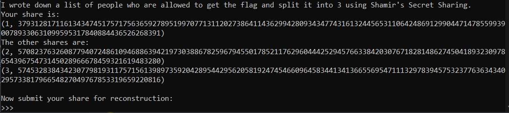
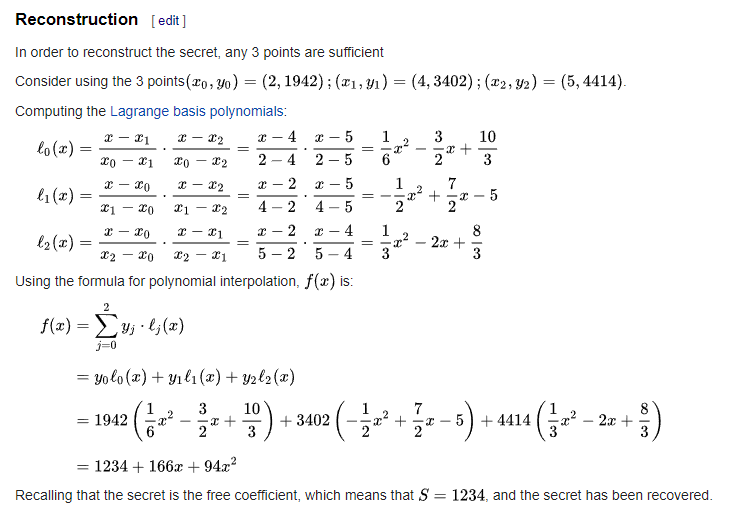
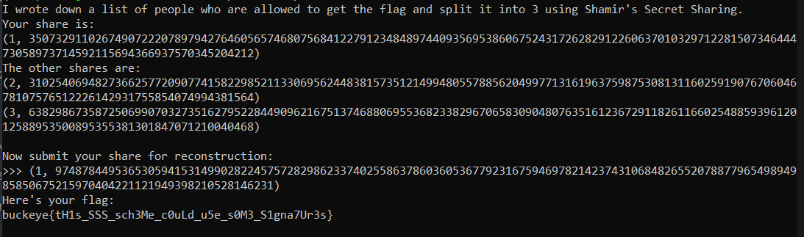

# SSSHIT

Another year, another crypto challenge. We all <3 math! Last year I "learned" Diffie-Hellman. This year I "learned" about [Shamir's Secret Sharing](https://en.wikipedia.org/wiki/Shamir%27s_Secret_Sharing) which is actually really interesting! Never heard of it before. Solid difficulty and I liked it just cause we were able to reverse it pretty easily compared to other stuff.

**Category**: crypto

**Points**: 330 points (41 solves)

**Description**:
SSS is so cool!

**Attachments**: [chall.py](./chall.py)

## Overview
We are given a python script containing source code for the challenge. From inspection, you can see and do research on [Shamir's Secret Sharing](https://en.wikipedia.org/wiki/Shamir%27s_Secret_Sharing). TLDR, it's an algorithm that allows the distribution of a secret such that only when a certain number of shares are combined, you will get back your secret. In this problem, the shares are generated with all 3 shares and you NEED all 3 shares to get back your secret since the polynomial to generate the shares is `N_SHARES - 1` which including the original secret, makes `k=3`.

```python
polynomial = [MESSAGE] + [random.randrange(1, p) for _ in range(N_SHARES - 1)]
```

The follow code prompts the user for input:

```python
print("Your share is:")
print(points[0])
print("The other shares are:")
for i in range(1, len(points)):
    print(points[i])

print()
print("Now submit your share for reconstruction:")
your_input = ast.literal_eval(input(">>> "))
if (
    type(your_input) is not tuple
    or len(your_input) != 2
    or type(your_input[0]) is not int
    or type(your_input[1]) is not int
    or your_input[0] != 1
    or not (0 <= your_input[1] < p)
):
    print("Bad input")
    return
```

which is formatted like this: 


Notice how there is an input validation where the input must be a tuple of length 2 where both values must be a number with the first number being 1 and the second number being within the generated prime p. Note that p is generated with `p = cun.getPrime(512)` so we basically have no hope of reversing this and getting p. 

We can try to put in our original share and it prints back `qxxxb, BuckeyeCTF admins, and NOT YOU` but we want the actual reconstructed message to be `qxxxb, BuckeyeCTF admins, and ME` after we insert our share. 

```python
reconstructed_message = cun.long_to_bytes(y_intercept)
if reconstructed_message == b"qxxxb, BuckeyeCTF admins, and ME":
    print("Here's your flag:")
    print("buckeye{?????????????????????????????????????????}")
else:
    print(f"Sorry, only these people can see the flag: {reconstructed_message}")
```

The reverse function is below is kind of complicated but the general idea is to reverse this operation so that when we pool our share together, it produces this new message.

```python
xs = [point[0] for point in points]
ys = [point[1] for point in points]

y_intercept = 0
for j in range(N_SHARES):
    product = 1
    for i in range(N_SHARES):
        if i != j:
            product = (product * xs[i] * pow(xs[i] - xs[j], -1, p)) % p
    y_intercept = (y_intercept + ys[j] * product) % p
```

## Solution
With the help of the Example Calculation section within the Wikipedia page, we have simpler example which makes the operation easier to understand. 



In their example, they have 6 total shares and only 3 of them are needed to recover the secret which lies in the y_intercept of the equation we try to generate back. We notice that you ONLY need to recover the y_intercept as the other values with different degrees of x does not matter in recovering the secret message. We can then see that the y_intercept number is only effected by a simple arithmetic calculation that relies only on the (x0, x1, x2) values and in our case equals (1, 2, 3). Plugging in those values results in (3, -3, 1) and in relation to the reconstruction equation, it basically says `(3*y0 - 3*y1 + y2) = S`. 

Simple enough right?.... No... Since this is crypto, we need to use mod and there are many places in which this simple reverse calculation may fail. 1) The secret just cannot be negative so you have to be careful of the values used. 2) Multiplying by 3 will almost definitely result in a number that is greater than the prime which after being modded will result in a smaller number and ruin the calculation. 

We tried multiple ways to reverse our script such as with [solve.py](./solve.py) and [solve1.py](./solve1.py) but our ultimate solution looked like this, which can be found in [solution.py](./solution.py)

```python
import Crypto.Util.number as cun
from decimal import Decimal, getcontext
getcontext().prec = 1000

GOAL = cun.bytes_to_long(b"qxxxb, BuckeyeCTF admins, and ME")

xs = [1, 2, 3]
ys = [5133944182695820318430249092705160263339994950951329583292424012251640154888126802601583379051088651306590532598546499944848696378228399875653862896025564,
4903310259247793100776794830160293151285475451519009723612495223779225906538724170960749325652695011189223047075638453499871105071977858926990970784864574,
8698873741135305608596852181819874295890221589176964585667107555636942592406467653629859286276173341014486534975677650362445712317941794717858399029406622]

val = - Decimal( -ys[1] * 3 + ys[2] - GOAL) / Decimal(3)

print(val)
```

You can see that we divided by 3 and if you rounded that number, you would not get the correct result since each calculation much be accurate. Our solution: keep trying different seeds until you get something that has no repeating .333333 or .66666 while also making sure to be quick enough so that it doesn't time out. 

How do we become quicker you ask.... You have 2 people on a single liveshare where one person connects to the server and grabs all 3 shares, copies it into the script. The second person runs it, repeats the process until they get back a whole number. Paste that value into discord where person 1 grabs it, submits, and hope that it doesn't cause any problem with reconstruction and issues with prime. It took us about 15 seeds to get 3 numbers without decimals and the 3rd try got us the flag!



In hindsight, you can probably script this out and have a computer do this but thats kinda cringe. Not sure if this was the intended solve but good challenge as always Yu-Shiang!